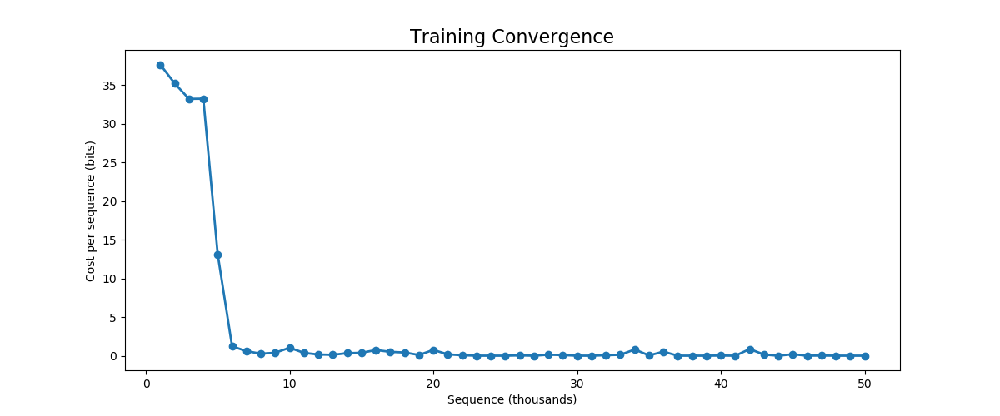
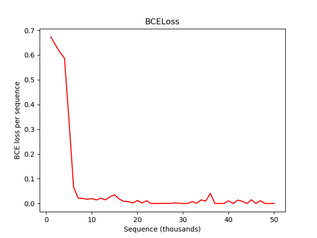
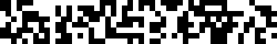

# An implementation of Neural Turing Machine
This repository tries to implement the Neural Turing Machine (NTM) architecture. This was done as a part of the course project for *CS786 (Computational Cognitive Science)* at IIT Kanpur. Here I have tried to replicate the performance of the [original NTM paper](https://arxiv.org/abs/1410.5401) in the Copy-task.

## Installation and Setup
This code is written in `Python 3.7` and requires the packages listed in `requirements.txt`.

Clone the repository to your local machine and directory of choice:
```
git clone https://github.com/vaibhavjindal/neural_turing_machine.git
```
Install the required libraries/packages using:
```
pip install -r requirements.txt
```

## Training 
The training code for the Copy-Task is present in `train_copy.py`. Use the following command to train the model for 50,000 batches each with batch_size=1.
```
python3 train_copy.py
```
The default hyperparameters of the model have been set such that the model converges perfectly. A checkpoint of the current state of the model is automatically saved after every 5000 epochs. The final training information and the model weights can be retrieved from the last checkpoint. In order to play with the hyperparameters, one can use the following command to have a look at the usage of `train_copy.py`, and make changes accordingly:
```
python3 train_copy.py -h
```

### Viewing the learning curves
To view the learning curves, the following command can be used:
```
python3 plot_learning_curve.py
```
This command will generate two plots - "Cost per sequence", where the cost is the average number of error bits per sequence and "BCEloss per sequence", which is the value of the BCEloss during training. Two example curves are shown below:
#### Cost vs Sequence

#### BCE_Loss vs Sequence



## Evaluation
The file `evaluate.py` runs the evaluation code on a saved model by running the model on random sequences of various lengths. It saves the target and the output sequences as images `target_len_{sequence_length}.png` and `output_len_{sequence_length}.png` for different values of sequence_lengths. In order to run the code, use the command:
```
python3 evaluate.py --checkpoint_path ./checkpoints/copy-task-1000-batch-50000.model
```
`./checkpoints/copy-task-1000-batch-50000.model` contains the model weights of a model trained with 50,000 batches. To use any other model, the path can be appropriately changed. Use `-h` option to see the other hyperparametrs.

**Note**: Model-specific hyperparameters such as the controller size, memory size etc, should be the same for the `train_copy.py` and `evaluate.py` so that the stored weights can be successfully loaded during evaluation.

Here are some of the images produced by `evaluate.py` using the stored weights:
#### Target and Output of the NTM for sequence_length = 30
Target Sequence


Output Sequence


  
#### Target and Output of the NTM for sequence_length = 50
Target Sequence





Output Sequence


These results show that our model has learned the copy-task well as it was trained only on random sequences of length 1-20, but it does perform nicely on inputs of lengths 30 and 50 as well.

## Acknowledgement
This work has been inspired by this excellent implementation([https://github.com/loudinthecloud/pytorch-ntm.git](https://github.com/loudinthecloud/pytorch-ntm.git)). Some compenents of the code such as the LSTMController and some other functions have been directly taken from here and that code has been appropriately annotated in comments. The default hyperparameters in `train_copy.py` have also been obtained from this repository only.
